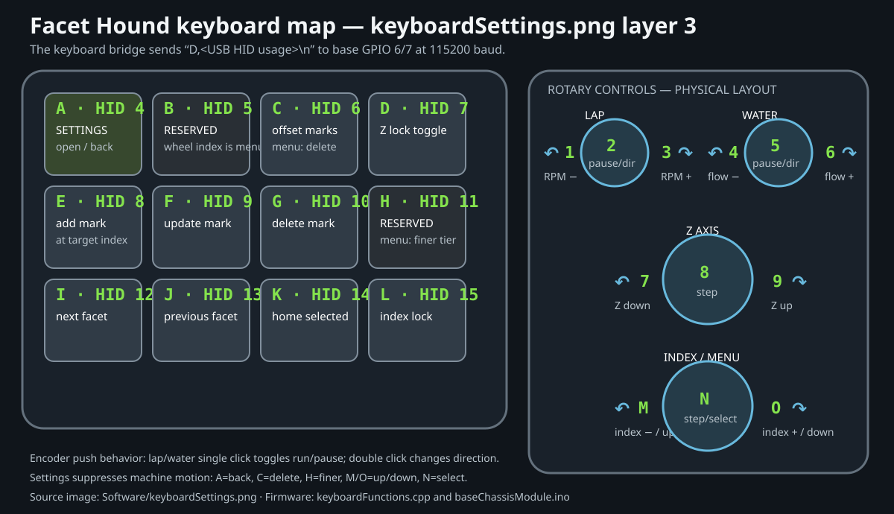

# Keyboard map

[`keyboardSettings.png`](../usbToUART/keyboardSettings.png) programs ordinary
HID key numbers into the dedicated
keyboard module. That module reports them to the base as `D,<usage>\n` over
the keyboard UART on GPIO 6/7 at 115200 baud. For example, physical **A** is
HID usage 4, **M** is 16, and **1** is 30. This dedicated UART connection is
intentional: **do not replace it with a Pico USB-host keyboard connection.**
The Pico's native USB port is reserved for the optional PC diagnostic console.

| Physical | HID | Normal mode | Settings mode | Firmware action |
|---|---:|---|---|---|
| A (top-left) | 4 | Open Settings | Back/close | `MENU_TOGGLE_KEY` |
| B | 5 | Next tier, lowest-index facet | Suppressed | Loaded SD gem or built-in gem navigation |
| C | 6 | Previous tier, lowest-index facet | Delete item | Loaded SD gem or built-in gem navigation |
| D | 7 | Toggle Z lock | Suppressed | `toggleZLock()` |
| E | 8 | Add mark at target index | Suppressed | `addPositionToList()` |
| F | 9 | Update selected mark | Suppressed | `updatePositionInList()` |
| G | 10 | Delete selected mark | Suppressed | `deletePositionInList()` |
| H | 11 | Offset all marks | Finer edit tier | `toggleCheatMode()` / `MENU_TIER_FINER_KEY` |
| I | 12 | Next facet/mark | Suppressed | Next higher index in the tier for gem views; next mark in Classic |
| J | 13 | Previous facet/mark | Suppressed | Next lower index in the tier for gem views; previous mark in Classic |
| K | 14 | Home selected facet/mark | Suppressed | `homeMarkPoint()` |
| L | 15 | Toggle index lock | Suppressed | `toggleTiltLock()` |
| M | 16 | Index decrement | Menu up | `changeTiltAngle()` / `MENUKEY,UP` |
| N | 17 | Cycle index step | Select | `changeTwistIndex()` / `MENUKEY,SELECT` |
| O | 18 | Index increment | Menu down | `changeTiltAngle()` / `MENUKEY,DOWN` |
| 1 | 30 | Lap RPM −1 | Suppressed | `changeMotorSpeed(-1)` |
| 2 | 31 | Lap run/pause; double-click direction | Suppressed | `changeMotorDirection()` |
| 3 | 32 | Lap RPM +1 | Suppressed | `changeMotorSpeed(+1)` |
| 4 | 33 | Flow −1 | Suppressed | `changeFlowRate(-1)` |
| 5 | 34 | Pump run/pause; double-click direction | Suppressed | `changeFlowDirection()` |
| 6 | 35 | Flow +1 | Suppressed | `changeFlowRate(+1)` |
| 7 | 36 | Z down | Suppressed | `changeZMotorSteps(true)` |
| 8 | 37 | Cycle Z step | Suppressed | `changeZMultiplier()` |
| 9 | 38 | Z up | Suppressed | `changeZMotorSteps(false)` |

The PC diagnostic console can inject the same *firmware action* with `key A`,
`key 7`, or `KEY <hid-code>` for bench testing. That USB CDC test input is
separate from, and does not reconfigure, the keyboard UART.

When no SD design is loaded, Dynamic and Static use the display's built-in gem
as a real selectable job. The base contains the matching compact facet-pose
table, so the green face is selected from the target tier/facet rather than
guessed from the live tip encoder. Pavilion/opposite-approach targets include
the required half-wheel index offset. The display reports its mode at startup
so this behavior does not replace Classic's editable mark list.
